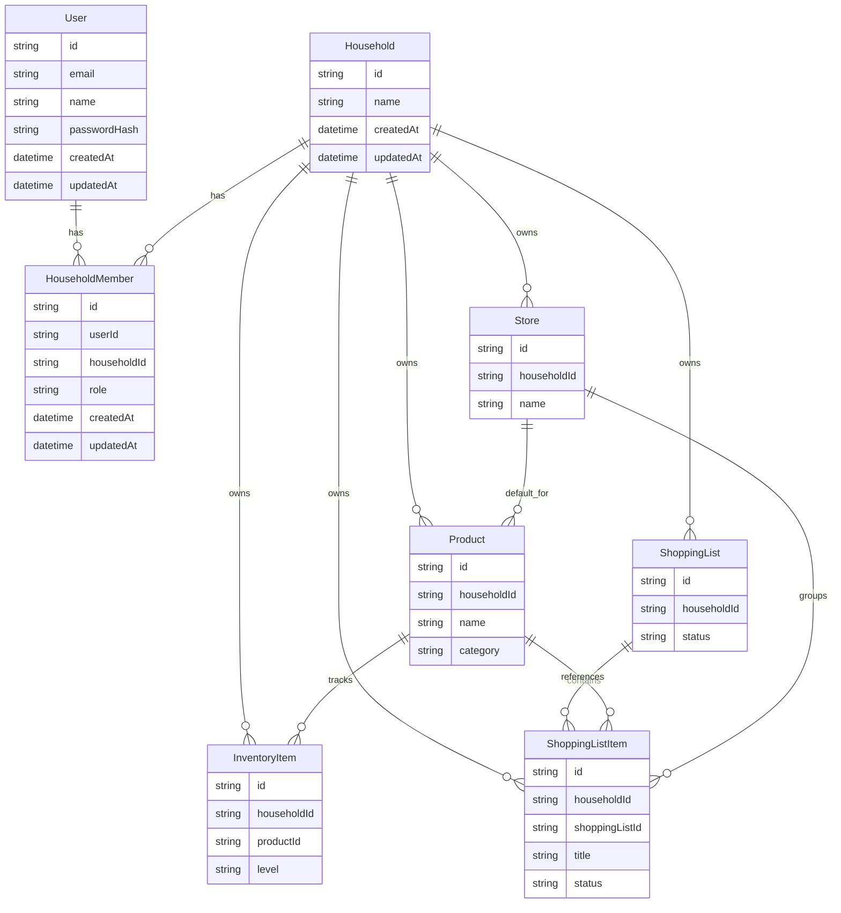

# Architecture

Household Refill OSは、家庭内LANで動かす単一リポジトリのローカルWebアプリです。外部公開SaaSではなく、家庭内の補充判断を軽くする道具として設計します。

## 現在のフェーズ

Phase 2では、Phase 1の認証済みアプリ骨格に家庭単位の買い物・商品・在庫データを追加しています。

実装済み:

- Next.js App Router
- TypeScript
- Tailwind CSS
- NextAuth Credentials Provider
- Prisma
- SQLite
- User / Household / HouseholdMember
- owner / memberロール
- seedによる初期owner作成
- 認証済みlayout
- Docker Composeによる起動
- Docker内での検証コマンド実行
- Product / InventoryItem / Store / ShoppingList / ShoppingListItem
- 家庭境界付きServer Actions
- 買い物項目追加、チェック保存、残量更新

今後の対象:

- 商品・店舗の編集と削除
- 買い物履歴のアーカイブ
- AI補助
- PWA
- 通知
- 細かなロール別UI制御

## ランタイム構成

```text
Browser
  -> Next.js App Router
    -> Auth.js / NextAuth
    -> Server Components / Client Components
    -> Prisma Client
      -> SQLite
```

開発・運用の標準入口はDocker Composeです。

```text
docker compose up
  -> app container
    -> pnpm db:generate
    -> pnpm db:deploy
    -> pnpm db:seed
    -> pnpm dev --hostname 0.0.0.0
```

ホスト側にNode.jsやpnpmを要求しません。依存関係とNext.js build成果物はDocker named volumeに置きます。

## レイヤー構成

```text
app/
  (auth)/
    login/
  (app)/
    page.tsx
    usuals/
    inventory/
    settings/
  api/
    auth/[...nextauth]/

components/
  app-shell/
  auth/
  inventory/
  settings/
  shopping/
  ui/

lib/
  auth/
  db/

prisma/
  schema.prisma
  migrations/
  seed.ts

tests/
  e2e/
```

## ルーティング

`app/(app)/layout.tsx` が認証ガードです。未ログインの場合は `/login` にリダイレクトします。

`app/(auth)/login/page.tsx` はログイン済みユーザーを `/` に戻します。

`app/api/auth/[...nextauth]/route.ts` はNextAuthのRoute Handlerです。

Phase 2以降のアプリ用Route HandlerまたはServer Actionでは、最初に `requireAppSession()` を呼び、家庭境界に必要な `householdId` を取得します。

## 認証

認証はNextAuth v4のCredentials Providerです。

- ログインIDはメールアドレス文字列
- パスワードはbcryptjsでハッシュ検証
- セッション方式はJWT
- JWTとsessionには `userId`, `householdId`, `householdName`, `role` を含める
- 初期ownerはseedで作成する

認証設定は `lib/auth/options.ts` に集約しています。サーバー側でセッションが必要な場合は `lib/auth/session.ts` の `requireAppSession()` を使います。

## データモデル

Phase 2のDBモデルは、認証・家庭モデルに補充管理の中核モデルを加えています。



`HouseholdMember.role` は `owner` / `member` です。現時点ではロールの保存と表示までを行い、細かな権限制御はPhase 3以降で追加します。

## householdId境界

このアプリのデータ分離単位は `Household` です。`Product`, `InventoryItem`, `Store`, `ShoppingList`, `ShoppingListItem` はすべて `householdId` を持ちます。

実装ルール:

- DB読み取りでは `where` に `householdId: session.user.householdId` を含める
- DB作成では入力値ではなくsession由来の `householdId` を使う
- URLパラメータやフォーム値の `householdId` を信用しない
- 削除・更新も必ず `householdId` で絞る
- owner/memberの権限制御を追加するときも家庭境界を先に守る

## SQLite配置

Prisma 6ではSQLiteの相対パスが `prisma/schema.prisma` 基準で解釈されます。

そのため、プロジェクト直下のDBを使う設定は次です。

```bash
DATABASE_URL="file:../data/app.db"
```

実体:

```text
./data/app.db
```

`data/` は `.gitignore` 済みです。

## Docker

Dockerはこのプロジェクトの標準開発面です。ホストにpnpmを入れず、コマンドはコンテナ内で実行します。

`Dockerfile` では、依存インストール前に `prisma/` と `prisma.config.ts` をコピーします。これは `@prisma/client` のpostinstallおよび `pnpm db:generate` がschemaを必要とするためです。

`app` サービス:

- `Dockerfile` からビルド
- `.env` の値をComposeが展開
- `./data:/app/data` でSQLite DBを保持
- `app_node_modules:/app/node_modules`
- `app_next:/app/.next`
- `3000:3000` を公開

`e2e` サービス:

- `Dockerfile.e2e` で `mcr.microsoft.com/playwright:v1.49.1-noble` を拡張
- pnpmはCorepackではなく `@pnpm/exe` をnpm経由で事前インストール
- `profiles: ["test"]` のため通常起動では走らない
- Playwrightブラウザをホストに入れずにE2Eを実行する
- E2E用DBはコンテナ内の一時ファイルシステムに分離する

## 環境変数ファイル

Docker Compose:

```text
.env
```

ホストNode.jsで直接動かす場合:

```text
.env.local
```

このプロジェクトの標準はDocker Composeなので、通常は `.env` だけで足ります。`.env`, `.env.local`, `data/` はコミットしません。

## テスト境界

変更時に確認する主な項目です。

- 型チェック
- ESLint
- Next.js build
- 未ログイン時のログイン画面表示
- seed ownerでログインできること
- 認証後に「今日買う」へ入れること
- 買い物リストのチェックUIが動くこと

標準コマンド:

```bash
docker compose run --rm --no-deps app pnpm typecheck
docker compose run --rm --no-deps app pnpm lint
docker compose run --rm --no-deps app pnpm build
docker compose run --rm e2e
```

## セキュリティ境界

- `.env` と `.env.local` はコミットしない
- `AUTH_SECRET` は実運用前に変更する
- seed passwordはハッシュ化して保存する
- seedは既存ownerのパスワードを上書きしない
- アプリ画面は認証済みlayout配下に置く
- アプリデータのDBアクセスは必ず `householdId` を条件に含める
- LAN外公開はしない前提
- 外部公開する場合は別途セキュリティレビューを行う

## 次の設計課題

画面に密着したPhase 2の更新はServer Actionsへ寄せました。今後、外部連携やAPI化が必要な操作だけRoute Handlersとして分離します。

次に優先するもの:

- 商品・店舗の編集、削除、並び替え
- 買い物リストの完了・履歴化
- owner/memberの操作権限
- 通知と補充提案
- 残量更新
- 入力validation
- CRUD操作のエラー表示
