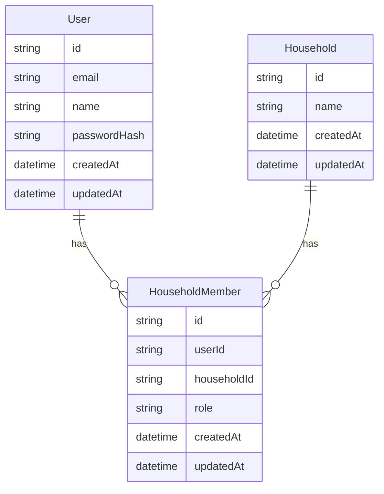

# Architecture

Household Refill OSは、家庭内LANで動かす単一家庭向けローカルWebアプリです。外部公開SaaSではなく、家庭内の補充判断を軽くする道具として設計します。

## 現在のフェーズ

Phase 1では、静的UIに認証とアプリ骨格を追加しています。

実装済み:

- Next.js App Router
- TypeScript
- Tailwind CSS
- NextAuth Credentials Provider
- Prisma
- SQLite
- User / Household / HouseholdMember
- owner / memberロール
- seedによる初期owner作成

未実装:

- 商品・在庫・買い物リストの永続化
- CRUD API
- AI補助
- PWA
- 通知
- 細かなロール別UI制御

## レイヤー構成

```text
app/
  (auth)/
    login/
  (app)/
    page.tsx
    usuals/
    inventory/
    settings/
  api/
    auth/[...nextauth]/

components/
  app-shell/
  auth/
  inventory/
  settings/
  shopping/
  ui/

lib/
  auth/
  db/

prisma/
  schema.prisma
  migrations/
  seed.ts
```

## ルーティング

`app/(app)/layout.tsx` が認証ガードです。未ログインの場合は `/login` にリダイレクトします。

`app/(auth)/login/page.tsx` はログイン済みユーザーを `/` に戻します。

`app/api/auth/[...nextauth]/route.ts` はNextAuthのRoute Handlerです。

## 認証

認証はNextAuth v4のCredentials Providerです。

- ログインIDはメールアドレス文字列
- パスワードはbcryptjsでハッシュ検証
- セッション方式はJWT
- JWTとsessionには `userId`, `householdId`, `householdName`, `role` を含める

認証設定は `lib/auth/options.ts` に集約しています。サーバー側でセッションが必要な場合は `lib/auth/session.ts` の `requireAppSession()` を使います。

## データモデル

Phase 1のDBモデルは最小限です。



Phase 2ではこの `householdId` を必ず各データの境界に使います。

## SQLite配置

Prisma 6ではSQLiteの相対パスが `prisma/schema.prisma` 基準で解釈されます。

そのため、プロジェクト直下のDBを使う設定は次です。

```bash
DATABASE_URL="file:../data/app.db"
```

実体:

```text
./data/app.db
```

`data/` は `.gitignore` 済みです。

## Docker

Docker buildでは、依存インストール前に `prisma/` と `prisma.config.ts` をコピーします。これは `@prisma/client` のpostinstallおよび `pnpm db:generate` がschemaを必要とするためです。

Compose起動時は次を実行します。

```bash
pnpm db:generate
pnpm db:deploy
pnpm db:seed
pnpm dev --hostname 0.0.0.0
```

## セキュリティ境界

- `.env.local` はコミットしない
- `AUTH_SECRET` は実運用前に変更する
- seed passwordはハッシュ化して保存する
- アプリ画面は認証済みlayout配下に置く
- Phase 2以降のDBアクセスは必ず `householdId` を条件に含める

## 次の設計課題

Phase 2で追加する永続化データは、まずServer ActionsまたはRoute Handlersのどちらに寄せるかを決めます。家庭内ローカルアプリとしては、UI密着の操作はServer Actions、外部連携や将来のAPI化が必要な操作はRoute Handlersに分ける方針が自然です。
